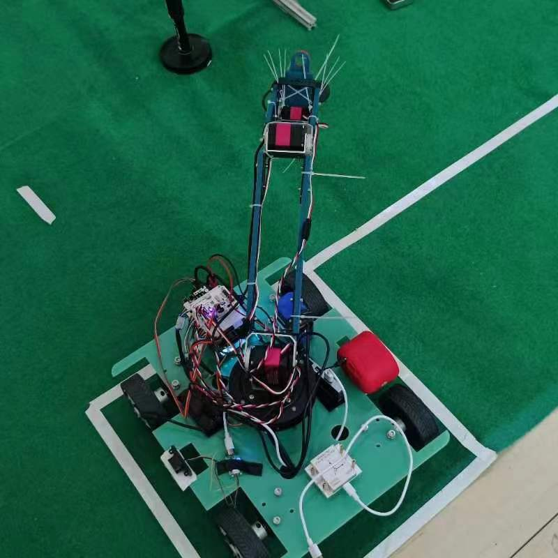

# 下地干活团队

> **天道酬勤，拒绝 *TM* 的歪门邪道！**

$$
1 + 1 +1 > 3
$$


## 一、团队成员

* **梁耿明**
* **卞江辉**
* **郭晓宇**

## 二、项目背景

&emsp;&emsp;主要围绕智慧农业研究领域，开展智慧农业以及农业机器人的技术研究。随着经济、社会的进一步发展，传统农业、林业、牧业、渔业，以及人类生命健康的相关专业，融合了电子信息、计算机控制、机器人技术、大数据、人工智能等知识后，智慧农业机器人的概念、内涵不断丰富，学科交叉的新技术、新应用、新发展不断涌现，应用场景不断扩展，发展迅速。本赛事模拟智能授粉作业过程，该比赛可以锻炼学生的实践创新能力和工程能力，同时可以激发优秀学者和青年投身到智慧农业和农业机器人的研究中，培养智慧农业的科研后备力量。


## 三、开源组成

一共有四个文件夹，分别是：

* **src** —— 存放各代码功能包
* **models** —— 存放各打印件的 STEP 源文件

* **serial_bash** —— 存放用于固定串口设备名的 sh 文件
* **race_rule** —— 存放比赛规则文件


## 四、硬件组成

| 地平线 RDK X3  2.0                      | [亚博智能 旭日X3派RDK开发板地平线机器人古月居ROS2树莓派AI套件-tmall.com天猫](https://detail.tmall.com/item.htm?spm=a21n57.1.item.3.29c45ae852foaF&priceTId=2100c80917224773608396003e0d64&utparam=%7B%22aplus_abtest%22:%22d62905fc07b25160b2cb2c0b3c017d8b%22%7D&id=675925264685&ns=1&abbucket=4&xxc=taobaoSearch&pisk=fn1xtSq7AuqmmHeGGZwksord9QUo6sQ4mi7IshxmCgIR53cguI2w6GKRbnvDGnc96NINjGQauFt1fGKGn8VhuZRw1kATtWbVtKUbeihXh4a65enbM72ulZRw1l3o1JVduMEDZcZ9CzdWWFY61KO6PatySjiffn9SVeLe1hs61zKW7EKsGnG6VLTKGuVDbb-n6O13UTZruPcis_L70QQYYXYAZEnXvZx8Uz18TKKCl3h_xDkMihKPOu2RzgXfmUST9ud5RTdXkGNIK36RPsJH9JMAAajV9I1LDjYkBnB5GL3s1aOymL6ODoH2ctjJLU9SWW8lx3_VGTUZVZsHDITWEWadPd6lgp50VjdCLZAcCgN-MMsrt6fKRQoHvFDbyzHZQKTodRhoqA-CfjLJxzx-QAJ8GfDAszksCcbvyH4oKAkwe5f..)         |
| --------------------------------------- | ------------------------------------------------------------------------------------------------------------------------------------------------------------------------------------------------------------------------------------------------------------------------------------------------------------------------------------------------------------------------------------------------------------------------------------------------------------------------------------------------------------------------------------------------------------------------------------------------------------------------------------------------------------------------------------------------------------------------------------------------------------------------------- |
| **FDISYSTEMS N200 IMU 惯导模块**  | [IMU惯导模块ROS工业防水FDISYSTEMS九轴姿态传感器2024年TI杯电赛-淘宝网 (taobao.com)](https://item.taobao.com/item.htm?spm=a21n57.1.item.1.89ea5513P2KJYJ&priceTId=2100c80217224774541251053e0e20&utparam=%7B%22aplus_abtest%22:%2270a5c18a4b468b4ca47555fa4109b205%22%7D&id=641144832994&ns=1&abbucket=4&pisk=fDKn9Affhe7I1W2-thjIyMT2RC0TjWs5RQERwgCr715_va5-RQbkwC_yvMpps_RvZTKp23Y_qK9Wvvs-dM9CVglxMmdkdps7S8V4IHbNbTpa4urztpSQLglxM04TQwGd4Up26ifG716lUkSyacJNF1Wz8gRP_NWVHWSP4QJZITWzL_5FTR5NEthjjW1phd-ZTanRIjQ_yHBh-_qdWux9qoQOgAC_qubRzw4pL1qz4hYsFlOCTqwONMCBF9AScksFreRhQgmubMABL37M2fnA-KWyNMKZUy52JBIwYE2z4djhTaKCoWcGgH9wcG7t0xvwfBpBjLer4OdA_ptFqmkfxM5FjOt-1k5k7U-dRgNEtgJGUgzz7rWIPu6Zehz7PwW1IsT4Nny585-0zADguI7FC9uk2A4zWSZzcQkiIr-C8O6ER)                         |
| **单线雷达**                      | *暂无链接*                                                                                                                                                                                                                                                                                                                                                                                                                                                                                                                                                                                                                                                                                                                                                                    |
| **亚博智能底层控制板**            | [ROS机器人主控制板STM32F103RCT6开发ROS2小车驱动扩展IMU树莓派5-淘宝网 (taobao.com)](https://item.taobao.com/item.htm?spm=a21n57.1.item.12.512264f3E4RhOm&priceTId=2100c80417224775014976079e0d69&utparam=%7B%22aplus_abtest%22:%226260bb067900cb25c0bc0db7bfbd73a9%22%7D&id=674835133218&ns=1&abbucket=4&pisk=fOFxtgj5Agjcq7BgGr6osiSL9bQufSUVmozBscmDCuE850AGujXZ6ln8bmDmGmAt6PEajlUNuVi_flngnTf3urlZ1McOt644txQfeopXGz_sWVxfM_XllrlZ1GLk19fLukImZXStCahSWVuj1xGsPzirSKi_fmMWV23E1cZs1anS7qn6GmOsVYgKGKCmbQoH6RNhU8sPu_R2g7350YaATdm8tqQiYrnRUIVJTxnQl0d1xHJiicnzOgX8zu2bm4rO9gh7R8hjkl1BK0w8PSkn999YAzq49jNdDI0oBme7GYL61zGrmYwTDipqc-q-L4MWW6uux0a4G8QwVrZnDjgSE6_LPAwugvPcVIhQLrc0Cu1JMksrtWVpRb-nvVvfyapwQxgkdOdkqdoQfI3-xamJQdkRGCvYsaJ6Ch4xyDbkKdJZe1f..)                    |
| **RDK X3 专用音频驱动板**         | [旭日X3派音频驱动板模块立体声编解码 播放/录音 耳机接口/麦克风-淘宝网 (taobao.com)](https://item.taobao.com/item.htm?spm=a21n57.1.item.1.1051245cOdKqf6&priceTId=2100c80417224775507613706e0d69&utparam=%7B%22aplus_abtest%22:%22877b420c463801bd5832ef681188ed0c%22%7D&id=696400567092&ns=1&abbucket=4&pisk=fE2qtlvMKtBq7ZViz4MZ4xSFmNHxbvQC3Rgsjlqicq0mllmiQz41DqZGkPyZrlFfDf_vbnez8d9fksEMQAMGRw6CdoIxBAbCwCJ3CEnZbEXsScvll3DNFw6Cdu5mDAZlRGFh0j0KfAmmsqcl4ciMnK4isLqoycnMocvc4u0-jAvmIIqorcmDncmiG7FTtnisiMrOH9k5g3ln-o00f8wl9YAYA4koU8m4dlrD6dvgUml4CC9B6BGbskhLho6wexZUZYm4S9bmEkVzAjyV8Kgt_8z4_rs660PajJHxLhX04xuqt-lvXKU34lVIa8shpxkmo5MYfH7b4-zbD8r6jQDqh7lU3vXpoVN7YRoaBNBz8oV3S5SzRFnoNtwTgFAZi0nrRgSkhj4xw0-eLcd96jQo42smeCAMJd96gJHw6ChY90uCmv5..&skuId=4950207661925) |
| **舵机驱动板**                    | [16路舵机控制器 机器人驱动控制板过载保护DIY创客机械臂专用配件-淘宝网 (taobao.com)](https://item.taobao.com/item.htm?spm=a21n57.1.item.1.38c29390IYkEQ1&priceTId=2100c80417224775779384010e0d67&utparam=%7B%22aplus_abtest%22:%224a2ed7dda02cf35d838895a6109dfa7f%22%7D&id=23334420583&ns=1&abbucket=4&pisk=fmPItgVgiHxCgDUsqvQZCk9Xs6hW2k12AUg8ozdeyXhK2Ra0VD7lKXysVlEsvB7hKYn7xXHuL0oEVbaucNSVgsz3-bcO0i52S98AQj0Jw2KrBP3qKG7wbsz3-0YB2ZyOgL6XjYF-yuHKBc3-X2n-eYQsBqu-wBHJ9dKtj4h-2unLW13orBK-vYptG19Z7GogRNd3fXQPDtzmfQdXSyMpHu9yFLTx8vnxmrO-75gIdmULtk57QVFa1xkwziGToRrK5j1W6XMbpkgTSgOjv-zm6cEJAGugpkNtF57lKPNSAxFKCUO07bg82YwGcIuITRMbOJbkXyEqA-h3zEsU5xwsnVH9PphU3rPoHWCBmckmPogbAHsyLIofQ4JW5xAS5m715LvyP6FZgNZaKpMKSV7f5N9qpnAJapVP5dsIpV0a_N_63A5..)                      |
| **单点激光测距模块 stp23/stp23l** | [STP-23单点激光测距模块传感器高精度TOF测距原理毫米级串口输出-tmall.com天猫](https://detail.tmall.com/item.htm?id=678386670103&spm=a1z09.2.0.0.6cf02e8dI7SoXE&_u=13nmt0beec65&pisk=fnhn08ZblvyIpCQJxfVBeWNZ8i9OdMNSa0C827EyQlr6P9BpR8zrr0c-p4r8Z0moqkeyAWhojqgJRbLQTQ4rDcV-JkE-jUmKP_KBFWCPqDg2A2EJRbqzjDouFeZ84um-zvL9MI3IR7NzZndvMKcY7oihL8yez1zL-A3FpZuIR7ZPUAgeI26kxG0na8oz_Rzuz7zUauPwSzUfa7rUUGWaulrza7ozQNz48wSPauWw_jhhAk3j7f-UeCMlr4bEMy23q6EGZ4GFMJEVCl5lZ8LTLoRYj_5rsy066KuhiLEqhkeYfcROt70arm4mxG-gaVcIiRlef_mmjxPg5AtlEoDrJxMzIeRESWq3nfeO8TVnUDGudvbWlVPEfxZbLdt_SXhYEowGbHutSkymEDK1akHm7c2x6GCY_qkgsgWAQtzBF_awyfW5FJz_SoMVVj7SX5akEFYG3myU5yJowFXPBi1PG08MStlQLPaed)                                                                                               |
| **散热双风扇模块**                | [树莓派RaspberryPi3B+/4B LED散热双风扇模块 炫光降温风扇扩展板-淘宝网 (taobao.com)](https://item.taobao.com/item.htm?spm=a1z0k.7628869.0.0.697537deHZGObV&id=630497679599&_u=t2dmg8j26111&sku_properties=-3:-5)                                                                                                                                                                                                                                                                                                                                                                                                                                                                                                                                                                     |
| **音响**                          | [HP惠普蓝牙音响低音炮无线音箱迷你家用小音响U盘插卡音乐播放器-tmall.com天猫](https://detail.tmall.com/item.htm?id=693892195446&spm=a1z09.2.0.0.6cf02e8dI7SoXE&_u=13nmt0bec4f6&pisk=fZEt0ZfCN6fgj170fR_nm15s6gWh-leaL5yWmjcMlWFLM8pgSqcmlmFzwqtc7c0xDWG3jf2ifxgbi7ai1PcDDoFU6hxmfSjxG8zF3fDgjKHbR5K0SRcgJKnaxPxms1oYh7mAZ_jlqRyZYm1lZz9UOBnSFnTXifgBAQc9IaslqRyKZlVQDgXVylUsNxij5qiCAXkxGhMbGDtIhXtshhMXO9HqOjijlnOBdAD6GnMX5XhAjj-EZnUbqZDXCK3ycnZ1bVh-uExvDbDsWRr-9J23vA3tN2jrORZ_t-Zgb27yrmy3ySUbOMKTMRa7GfqCNnh0zxeje0syeXZTHk3a-CTsechtPlgBE3e-lyEKjl12zJ2K14n3-w5iocFTzbu186PYpfVbX2OOtj4uKlgLN6xLgqU_6vi544qu2LieZbHD59BpuEusKU_vxB4O04sspbXn9E8qJGtDWoXelEO0BvhlKUY2u2Ic.&sku_properties=5919063:6536025)                                                                    |
| **一个 360 度舵机**               | [20kg机器人车模大扭力30kg金属数码舵机60kg大角度可控云台航拍-淘宝网 (taobao.com)](https://item.taobao.com/item.htm?spm=a1z09.2.0.0.6cf02e8dI7SoXE&id=36360286212&_u=13nmt0be1880&pisk=fQcE0WfliBdEz0HublNz7WoiKENLZSKXqbZ7r40uRkqHeyOla4u0PeKJJAzoVcLJJWgu40o_X_aWp3CrbDgmdJiSdu4ujc0COuOLU0ujD01W9valacg8E0Gry_zor0LLVepsJ2F8Zntj4IgKJHWwxDcU-5biWr4lxFHHZxV8ZntPC_2pg7njoSgw4RYaPzah-02nSl44jyXht0qgIr4fx7VoqVYazyjhq9flSP448jsiexbQPJYqyIsUug_3do03x4gSsM2Cp2Zacocg8jiq-TClZfzULb65aKvzdY0YHXgBa1FIuAVg80ADx50mQqwETn5Q28lZYYoBPTUZU4cY9S7ktVPUY-cUpaCKmVuohRl6oIFUtkD794_2AVlEA2hZPaXgTWMa3XPDMMqSCqlzzbKJ_munn0DP4Rj8SROIwvSlUJ4T7oTwS6wnvRhLhUPfeTepjPrX-5BlEiC5N9lYaTB8pxUaceVV.)                                                                                            |
| **三个 270 度舵机**               | *暂无链接*                                                                                                                                                                                                                                                                                                                                                                                                                                                                                                                                                                                                                                                                                                                                                                    |

## 五、重要事项


<div align="center">
  
</div>


1. 车体不得一丝磕碰，预防影响 **IMU** 精度
3. 不启动 **IMU** 读取程序时，需拔掉 **IMU** 的 **USB** 读取接口
4. 不在运行程序的 **X3** 派和 **IMU** 需用小风扇对着吹
5. **X3** 派初开机时，先录音，激活音频板

```
sust_record
```

```
sust_preplay
```

## 六、操作流程

1. 准备好三个终端，一个用于启动 **launch**，一个用于启动 **python** 文件，一个用于测试音频板
2. 比赛前测试音频板是否可以播放音频

```
sust_record
```

```
sust_preplay
```

4. 用各种工具不断调整车体的初始位置，这个期间电脑掌控者不断测试音频版是否能播放音频
5. 在确保车体的初始位置正确和音频板能播放音频后，准备启动程序
6. 启动 **upupup.launch.py**

```
ros2 launch yahboomcar_bringup upupup.launch.py
# or
upupup
```

6. 在确保 **launch** 正常运行后，运行比赛逻辑代码

```
python3 game_process.py
# or
game
```

## 七、重要的子节点

* 激光 **stp23l**

```
ros2 launch ldlidar stp23l.launch.py
```

* 激光 **stp23**

```
ros2 launch ldlidar stp23.launch.py
```

* 视觉 **Yolo**

```
ros2 launch dnn_node_example dnn_node_example.launch.py
```

* **IMU** 数据读取

```
ros2 launch fdilink_ahrs ahrs_driver.launch.py
```

* 舵机板通讯

```
ros2 run yahboomcar_bringup servo
```

## 八、常用终端命令

* 扫描 **WIFI** 网络

```
sudo nmcli device wifi rescan
```

* 列出找出的 **WIFI**

```
sudo nmcli device wifi list
```

* 连接指定 **WIFI**

```
sudo wifi_connect "" ""
```

* 工作空间编译

```
colcon build --packages-select <package_name>
```

* 查看音频板硬件参数：
  1. 后缀为 **P** 的是播放
  2. 后缀为 **C** 的是采集

```
ls /dev/sn*
```

* 通过命令行发布话题:

```
ros2 topic pub /voice_commands std_msgs/msg/Int32MultiArray '{data:[2,2,1,1]}' --once
```

* 设置静态 IP

```
nmcli connection modify 134 ipv4.method manual ipv4.addresses 192.168.3.33/24 ipv4.gateway 192.168.3.1 ipv4.dns 8.8.8.8
```

* 查看网关地址，在这些命令的输出中，寻找default行，该行的via字段后面跟的就是你的网关地址

```
ip route show
```

## 九、快捷命令

* 测试音频板是否能播放音频

```
sust_record
```

* 比赛前预播放音频

```
sust_preplay
```

* 启动集成 **launch**

```
upupup
```

* 启动比赛逻辑代码

```
game
```

* 查看 **readme** 文档

```
sust_books
```

* 打开 YoloV5 视觉

```
vision
```

* 连接热点

```
wifi_phone
```

* 连接路由器 wifi

```
wifi_134
```

* 在终端列出 wifi 列表

```
wifi_list
```
